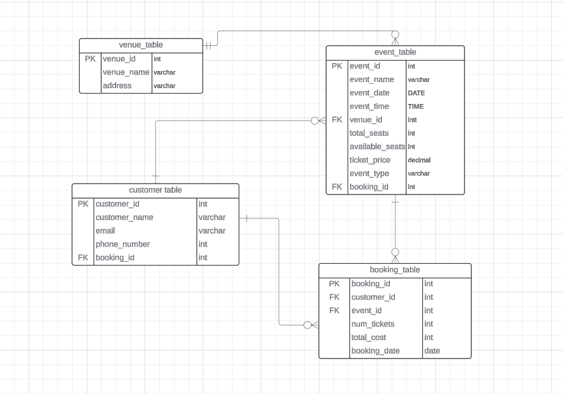

## Ticket Booking System 
### Tasks 1: Database Design: 

1. Create the database named "TicketBookingSystem"      
    ```SQL
    create database TicketBookingsys;
    ```
2. Write SQL scripts to create the mentioned tables with appropriate data types, constraints, and 
relationships.  
• Venu  
• Event  
• Customers  
• Booking 

-  venue table

    ```sql
    CREATE TABLE Venue (
    venue_id INT PRIMARY KEY,
    venue_name VARCHAR(100) NOT NULL,
    address VARCHAR(200) NOT NULL);
    ```

- event table
    ```sql
    CREATE TABLE Event (
    event_id INT PRIMARY KEY,
    event_name VARCHAR(100) NOT NULL,
    event_date DATE NOT NULL,
    event_time TIME NOT NULL,
    venue_id INT NOT NULL,
    total_seats INT NOT NULL,
    available_seats INT NOT NULL,
    ticket_price DECIMAL(10, 2) NOT NULL,
    event_type VARCHAR(20) NOT NULL CHECK (event_type IN ('Movie', 'Sports', 'Concert')),
    FOREIGN KEY (venue_id) REFERENCES Venue(venue_id));
    ```
- customers table
    ```sql
    CREATE TABLE Customer (
    customer_id INT PRIMARY KEY,
    customer_name VARCHAR(100) NOT NULL,
    email VARCHAR(100) NOT NULL,
    phone_number VARCHAR(20) NOT NULL);
    ```
- booking table
    ```sql
    CREATE TABLE Booking (
    booking_id INT PRIMARY KEY,
    customer_id INT NOT NULL,
    event_id INT NOT NULL,
    num_tickets INT NOT NULL,
    total_cost DECIMAL(10, 2) NOT NULL,
    booking_date DATE NOT NULL,
    FOREIGN KEY (customer_id) REFERENCES Customer(customer_id),
    FOREIGN KEY (event_id) REFERENCES Event(event_id));
    ```
3. Create an ERD (Entity Relationship Diagram) for the database. 
 


## Tasks 2: Select, Where, Between, AND, LIKE: 

1. Write a SQL query to insert at least 10 sample records into each table. 

- Insert records into Venue table

```sql
INSERT INTO Venue (venue_id, venue_name, address) VALUES
(1, 'Music Hall', '789 Broadway, City X'),
(2, 'Soccer Stadium', '123 Oak St, City Y'),
(3, 'Cinema Palace', '456 Elm St, City Z'),
(4, 'Football Field', '789 Pine Ave, City W'),
(5, 'Concert Arena', '159 Maple Ln, City V'),
(6, 'Sports Complex', '753 Cedar Blvd, City U'),
(7, 'Movie Multiplex', '246 Birch Dr, City T'),
(8, 'Amphitheater', '987 Willow Ct, City S'),
(9, 'Performing Arts Center', '654 Spruce Way, City R'),
(10, 'Auditorium', '810 Walnut St, City Q');
```

- Insert records into Event table

```sql
INSERT INTO Event (event_id, event_name, event_date, event_time, venue_id, total_seats, available_seats, ticket_price, event_type) VALUES
(1, 'Rock Concert', '2023-06-15', '19:00:00', 1, 5000, 2500, 75.99, 'Concert'),
(2, 'Soccer Match', '2023-07-10', '15:00:00', 2, 50000, 10000, 30.50, 'Sports'),
(3, 'Movie Night', '2023-06-20', '18:30:00', 3, 300, 100, 12.99, 'Movie'),
(4, 'Football Game', '2023-08-01', '10:00:00', 4, 20000, 8000, 45.75, 'Sports'),
(5, 'Broadway Show', '2023-09-12', '20:00:00', 5, 2000, 500, 89.99, 'Concert'),
(6, 'Pop Concert', '2023-07-25', '21:00:00', 6, 10000, 3000, 65.25, 'Concert'),
(7, 'Basketball Tournament', '2023-06-10', '19:30:00', 7, 15000, 2000, 25.99, 'Sports'),
(8, 'Indie Film Festival', '2023-08-15', '14:00:00', 8, 200, 80, 9.99, 'Movie'),
(9, 'Country Music Concert', '2023-09-20', '18:00:00', 9, 8000, 1500, 55.50, 'Concert'),
(10, 'Opera Performance', '2023-10-05', '19:30:00', 10, 1500, 300, 120.00, 'Concert');
```

- Insert records into Customer table

```sql
INSERT INTO Customer (customer_id, customer_name, email, phone_number) VALUES
(1, 'John Doe', 'john.doe@email.com', '1234567890'),
(2, 'Jane Smith', 'jane.smith@email.com', '9876543210'),
(3, 'Michael Johnson', 'michael.johnson@email.com', '5551234567'),
(4, 'Emily Davis', 'emily.davis@email.com', '7778889990'),
(5, 'David Wilson', 'david.wilson@email.com', '1112223333'),
(6, 'Sophia Thompson', 'sophia.thompson@email.com', '4445556666'),
(7, 'Daniel Anderson', 'daniel.anderson@email.com', '7778889999'),
(8, 'Olivia Martinez', 'olivia.martinez@email.com', '2223334444'),
(9, 'William Taylor', 'william.taylor@email.com', '5556667777'),
(10, 'Ava Garcia', 'ava.garcia@email.com', '8889990000');
```

- Insert records into Booking table

```sql
INSERT INTO Booking (booking_id, customer_id, event_id, num_tickets, total_cost, booking_date) VALUES
(1, 1, 1, 2, 151.98, '2023-05-01'),
(2, 2, 2, 4, 122.00, '2023-06-15'),
(3, 3, 3, 2, 25.98, '2023-06-10'),
(4, 4, 4, 3, 137.25, '2023-07-20'),
(5, 5, 5, 5, 449.95, '2023-08-01'),
(6, 6, 6, 2, 130.50, '2023-07-01'),
(7, 7, 7, 4, 103.96, '2023-05-25'),
(8, 8, 8, 3, 29.97, '2023-07-30'),
(9, 9, 9, 6, 333.00, '2023-08-15'),
(10, 10, 10, 2, 240.00, '2023-09-01');
```

2. Write a SQL query to list all Events.
    ```sql
    select * from event
    ```
3. Write a SQL query to select events with available tickets.
    ```sql
    select event_name,available_seats from Event;
    ```
4. Write a SQL query to select events name partial match with ‘cup’.
    ```sql
    SELECT * FROM Event WHERE event_name LIKE '%cup%';
    ```

5. Write a SQL query to select events with ticket price range is between 1000 to 2500.
    ```sql
    SELECT * FROM Event WHERE ticket_price BETWEEN 1000 AND 2500;
    ```
6. Write a SQL query to retrieve events with dates falling within a specific range.
    ```sql
    SELECT * FROM Event WHERE event_date BETWEEN '2023-07-01' AND '2023-08-31';
    ```
7. Write a SQL query to retrieve events with available tickets that also have "Concert" in their name.
    ```sql
    SELECT * FROM Event WHERE available_seats > 0 AND event_name LIKE '%Concert%';
    ```

8. Write a SQL query to retrieve users in batches of 5, starting from the 6th user.
    ```sql
    SELECT * FROM Customer ORDER BY customer_id OFFSET 5 ROWS FETCH NEXT 5 ROWS ONLY;
    ```
9. Write a SQL query to retrieve bookings details contains booked no of ticket more than 4.
    ```sql
    SELECT * FROM Booking WHERE num_tickets > 4;
    ```
10. Write a SQL query to retrieve customer information whose phone number end with ‘000’
    ```sql
    SELECT * FROM Customer WHERE phone_number LIKE '%000';
    ```
11. Write a SQL query to retrieve the events in order whose seat capacity more than 15000.
    ```sql
    SELECT * FROM Event WHERE total_seats > 15000 ORDER BY total_seats DESC;
    ```
12. Write a SQL query to select events name not start with ‘x’, ‘y’, ‘z’
    ```sql
    SELECT * FROM Event WHERE event_name NOT LIKE 'x%' AND event_name NOT LIKE 'y%' AND event_name NOT LIKE 'z%';
    ```
## Task 3: Aggregate functions, Having,Order by, GroupBy and joins:

1. Write a SQL query to List Events and Their Average Ticket Prices.
    ```sql
    SELECT event_name, AVG(ticket_price) AS avg_ticket_price
    FROM Event
    GROUP BY event_name;
    ```
2. Write a SQL query to Calculate the Total Revenue Generated by Events.
    ```sql
    SELECT SUM(total_cost) AS total_revenue FROM Booking;
    ```
3. Write a SQL query to find the event with the highest ticket sales.
    ```sql
    select * from event where event_id=(select event_id from
    booking order by num_tickets desc OFFSET 0 ROWS FETCH
    NEXT 1 ROWS ONLY);
    ```
4. Write a SQL query to Calculate the Total Number of Tickets Sold for Each Event.
    ```sql
    SELECT event_id,SUM(num_tickets) FROM Booking GROUP BY event_id;
    ```
5. Write a SQL query to Find Events with No Ticket Sales.
    ```sql
    SELECT *FROM Event WHERE event_id NOT IN (
    SELECT DISTINCT event_id
    FROM Booking
    ```
6. Write a SQL query to Find the User Who Has Booked the Most Tickets.
    ```sql
    SELECT c.customer_id,c.customer_name,total_tickets_booked
    FROM Customer c JOIN ( SELECT customer_id,
    SUM(num_tickets) AS total_tickets_booked FROM Booking
        GROUP BY customer_id ORDER BY total_tickets_booked DESC OFFSET 0 ROWS
        FETCH NEXT 1 ROW ONLY
    ) AS top_customer ON c.customer_id = top_customer.customer_id;
    ```
7. Write a SQL query to List Events and the total number of tickets sold for each month.
    ```sql
    SELECT MONTH(event_date) AS month, COUNT(booking_id) AS total_tickets_sold
    FROM Booking JOIN Event ON Booking.event_id = Event.event_id
    GROUP BY MONTH(event_date);
    ```
8. Write a SQL query to calculate the average Ticket Price for Events in Each Venue.
    ```sql
    SELECT v.venue_id,v.venue_name, AVG(e.ticket_price) AS avg_ticket_price
    FROM Venue v JOIN Event e ON v.venue_id = e.venue_id
    GROUP BY v.venue_id,v.venue_name;
    ```
9. Write a SQL query to calculate the total Number of Tickets Sold for Each Event Type.
    ```sql
    SELECT e.event_type, SUM(b.num_tickets) AS total_tickets_sold
    FROM Event e JOIN Booking b ON e.event_id = b.event_id
    GROUP BY e.event_type;
    ```
10. Write a SQL query to calculate the total Revenue Generated by Events in Each Year.
    ```sql
    SELECT YEAR(e.event_date) AS event_year, SUM(b.total_cost) AS total_revenue
    FROM Event e JOIN Booking b ON e.event_id = b.event_id
    GROUP BY YEAR(e.event_date);
    ```
11. Write a SQL query to list users who have booked tickets for multiple events.
    ```sql
    SELECT c.customer_name FROM Customer c JOIN Booking b ON c.customer_id = b.customer_id GROUP BY c.customer_name
    HAVING COUNT(DISTINCT b.event_id) > 1;
    ```
12. Write a SQL query to calculate the Total Revenue Generated by Events for Each User.
    ```sql
    SELECT booking.customer_id, customer_name, SUM(total_cost) AS total_revenue FROM Booking
    JOIN Customer ON Booking.customer_id = Customer.customer_id 
    GROUP BY booking.customer_id, customer_name;
    ```
13. Write a SQL query to calculate the Average Ticket Price for Events in Each Category and Venue.
    ```sql
    SELECT e.event_type, v.venue_name, AVG(e.ticket_price) AS avg_ticket_price
    FROM Event e
    JOIN Venue v ON e.venue_id = v.venue_id
    GROUP BY e.event_type, v.venue_name;
    ```
14. Write a SQL query to list Users and the Total Number of Tickets They've Purchased in the Last 30 Days.
    ```sql
    SELECT c.customer_name, SUM(b.num_tickets) AS total_tickets_purchased
    FROM Customer c
    JOIN Booking b ON c.customer_id = b.customer_id
    WHERE b.booking_date >= DATEADD(DAY, -30, GETDATE())GROUP BY c.customer_name;
    ```
## Task 4:Subquery and its types:

1. Calculate the Average Ticket Price for Events in Each Venue Using a Subquery.
    ```sql
    SELECT v.venue_id, v.venue_name,(SELECT AVG(ticket_price) FROM Event WHERE venue_id = v.venue_id) AS avg_ticket_price
    FROM Venue v;
    ```
2. Find Events with More Than 50% of Tickets Sold using subquery.
    ```sql
    SELECT e.event_name
    FROM Event e
    WHERE e.total_seats > 0 AND ( SELECT SUM(b.num_tickets)
        FROM Booking b
        WHERE b.event_id = e.event_id) > (e.total_seats * 0.5);
    ```

3. Calculate the Total Number of Tickets Sold for Each Event.
    ```sql
    SELECT e.event_name,SUM(b.num_tickets) AS total_tickets_sold FROM Event e JOIN Booking b ON e.event_id = b.event_id GROUP BY e.event_name;
    ```
4. Find Users Who Have Not Booked Any Tickets Using a NOT EXISTS Subquery.
    ```sql
    SELECT c.customer_id,c.customer_name FROM Customer c
    WHERE NOT EXISTS ( SELECT 1 FROM Booking b
    WHERE b.customer_id = c.customer_id
    ```
5. List Events with No Ticket Sales Using a NOT IN Subquery.
    ```sql
    SELECT e.event_id,e.event_name FROM Event e
    WHERE e.event_id NOT IN ( SELECT event_id FROM Booking);
    ```
6. Calculate the Total Number of Tickets Sold for Each Event Type Using a Subquery in the FROM Clause.
    ```sql
    SELECT e.event_type,
    SUM(ticket_sales.total_tickets_sold) AS total_tickets_sold FROM Event e
    JOIN (SELECT event_type,SUM(num_tickets) AS total_tickets_sold FROM Event e JOIN Booking b ON e.event_id = b.event_id
    GROUP BY event_type
    ) AS ticket_sales ON e.event_type = ticket_sales.event_type
    GROUP BY e.event_type;
    ```

7. Find Events with Ticket Prices Higher Than the Average Ticket Price Using a Subquery in the WHERE Clause.
    ```sql
    SELECT e.event_id,e.event_name, e.ticket_price
    FROM Event e WHERE e.ticket_price > (
        SELECT AVG(ticket_price) FROM Event);
    ```

8. Calculate the Total Revenue Generated by Events for Each User Using a Correlated Subquery.
    ```sql
    SELECT c.customer_id,c.customer_name,( SELECT SUM(e.ticket_price * b.num_tickets)
    FROM Booking b JOIN Event e ON b.event_id = e.event_id
    WHERE b.customer_id = c.customer_id) AS total_revenue FROM Customer c;
    ```

9. List Users Who Have Booked Tickets for Events in a Given Venue Using a Subquery in the WHERE Clause.

    ```sql
    SELECT c.customer_name
    FROM Customer c WHERE EXISTS (
        SELECT 1 FROM Booking b
        JOIN Event e ON b.event_id = e.event_id
        JOIN Venue v ON e.venue_id = v.venue_id
        WHERE b.customer_id = c.customer_id
        AND v.venue_name = 'Venue Name'
    );
    ```
10. Calculate the Total Number of Tickets Sold for Each Event Category Using a Subquery with GROUP BY.
    ```sql
    SELECT e.event_type,SUM(ticket_sales.total_tickets_sold) AS total_tickets_sold
    FROM Event e JOIN (SELECT event_type, SUM(num_tickets) AS total_tickets_sold FROM Event e
    JOIN Booking b ON e.event_id = b.event_id
    GROUP BY event_type )
    AS ticket_sales ON e.event_type = ticket_sales.event_type
    GROUP BY e.event_type;
    ```
11. Find Users Who Have Booked Tickets for Events in each Month Using a Subquery with DATE_FORMAT.
    ```sql
    SELECT customer_id, customer_name, MONTH(booking_date) AS booking_month FROM Booking
    JOIN Customer ON Booking.customer_id = Customer.customer_id
    GROUP BY customer_id, customer_name, MONTH(booking_date);
    ```
12. Calculate the Average Ticket Price for Events in Each Venue Using a Subquery
    ```sql
    SELECT v.venue_name,( SELECT AVG(e.ticket_price)
    FROM Event e WHERE e.venue_id = v.venue_id) AS avg_ticket_price
    FROM Venue v;
    ```