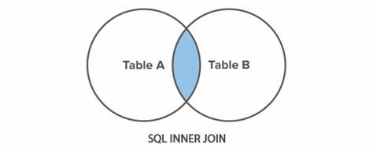
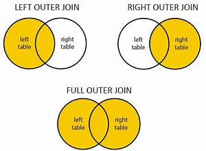

# INTRODUCTION TO SQL
SQL, or Structured Query Language, is a language designed to allow both technical and non-technical users query, manipulate, and transform data from a relational database.

- Select query for a specific columns
    ```
    SELECT column, another_column, …
    FROM mytable;
    ```
- Select query for all columns
    ```
    SELECT * 
    FROM mytable;
    ```

## SQL LESSON-2 
### Queries with constraints (Pt. 1)

- we need to use a WHERE clause in the query. The clause is applied to each row of data by checking specific column values to determine whether it should be included in the results or not

- Select query with constraints

    ```
    SELECT column, another_column, …FROM mytable 
    WHERE condition
    AND/OR another_condition
    AND/OR …;
    ```

|  OPERATOR           |  CONDITION                      |  SQL EXAMPLE   |
|---------------------| :-----------------------------: |--------------: |
|=, !=, < <=, >, >=	  | Standard numerical operators	   |col_name != 4   |
|BETWEEN … AND …	  |Number is within range of two values (inclusive)|col_name BETWEEN 1.5 AND 10.5|
|NOT BETWEEN..AND.|	Number is not within range of two values (inclusive)|	col_name NOT BETWEEN 1 AND 10|
|IN (…)	|Number exists in a list	|col_name IN (2, 4, 6)|
|NOT IN (…)	|Number does not exist in a list	|col_name NOT IN (1, 3, 5)|

## SQL LESSON-3
### Queries with constraints (Pt. 2)


| Operator|  Condition	         |Example      |
|---------| :-------------------: |-----------: |
|=	| Case sensitive exact string comparison (notice the single equals)	| col_name = "abc"|
|!= or <>|	Case sensitive exact string inequality comparison	|col_name != "abcd"|
|LIKE	|Case insensitive exact string comparison	|col_name LIKE "ABC"|
|NOT LIKE|	Case insensitive exact string inequality comparison	|col_name NOT LIKE "ABCD"|
|%	|Used anywhere in a string to match a sequence of zero or more characters (only with LIKE or NOT LIKE)	|col_name LIKE "%AT%"(matches "AT", "ATTIC", "CAT" or even "BATS")|
|_	|Used anywhere in a string to match a single character (only with LIKE or NOT LIKE)	|col_name LIKE "AN_"(matches "AND", but not "AN")|
|IN (…)	|String exists in a list	|col_name IN ("A", "B", "C")|
|NOT IN (…)|	String does not exist in a list	|col_name NOT IN ("D", "E", "F")|

- All strings must be quoted so that the query parser can distinguish words in the string from SQL keywords.
 #### EXAMPLE:
  - Select query with constraints
    ```SELECT column, another_column, …
    FROM mytable
    WHERE condition
    AND/OR another_condition
    AND/OR …;
    ```
## SQL LESSON-4
### Filtering and sorting Query results

- Select query with unique results
    ```
    SELECT DISTINCT column, another_column, …
    FROM mytable
    WHERE condition(s);
    ```
### Ordering results:
- Select query with ordered results
    ```
    SELECT column, another_column, …
    FROM mytable
    WHERE condition(s)
    ORDER BY column ASC/DESC;
    ```
### Limiting results to a subset
- Select query with limited rows
    ```
    SELECT column, another_column, …
    FROM mytable
    WHERE condition(s)
    ORDER BY column ASC/DESC
    LIMIT num_limit OFFSET num_offset;
    ```
## SQL Review: Simple SELECT Queries

- SELECT query
    ```
    SELECT column, another_column, …
    FROM mytable
    WHERE condition(s)
    ORDER BY column ASC/DESC
    LIMIT num_limit OFFSET num_offset;
    ```
## SQL Lesson 6: Multi-table queries with JOINs

- Select query with INNER JOIN on multiple tables
    ```
    SELECT column, another_table_column, …
    FROM mytable
    INNER JOIN another_table 
    ON mytable.id = another_table.id
    WHERE condition(s)
    ORDER BY column, … ASC/DESC
    LIMIT num_limit OFFSET num_offset;
    ```
    ## INNER JOIN
    
    
    - The INNER JOIN is a process that matches rows from the first table and the second table which have the same key (as defined by the ON constraint) to create a result row with the combined columns from both tables.

## SQL Lesson 7: OUTER JOINs

- If the two tables have asymmetric data, which can easily happen when data is entered in different stages, then we would have to use a LEFT JOIN, RIGHT JOIN or FULL JOIN instead to ensure that the data you need is not left out of the results.

- Select query with LEFT/RIGHT/FULL JOINs on     multiple tables
    ```
    SELECT column, another_column, …
    FROM mytable
    INNER/LEFT/RIGHT/FULL JOIN another_table 
    ON mytable.id = another_table.matching_id
    WHERE condition(s)
    ORDER BY column, … ASC/DESC
    LIMIT num_limit OFFSET num_offset;
    ```
## OUTER JOIN
 

 ## SQL Lesson 8: A short note on NULLs
 - Select query with constraints on NULL values

    ```
    SELECT column, another_column, …
    FROM mytable
    WHERE column IS/IS NOT NULL
    AND/OR another_condition
    AND/OR …;
    ```
## SQL Lesson 9: Queries with expressions
- Example query with expressions
    ```
    SELECT particle_speed / 2.0 AS half_particle_speed
    FROM physics_data
    WHERE ABS(particle_position) * 10.0 > 500;
    ```
- Select query with expression aliases
    ```
    SELECT col_expression AS expr_description, …
    FROM mytable;
    ```
- Example query with both column and table name aliases
    ```
    SELECT column AS better_column_name, …
    FROM a_long_widgets_table_name AS mywidgets
    INNER JOIN widget_sales
    ON mywidgets.id = widget_sales.widget_id;
    ```
## SQL Lesson 10: Queries with aggregates (Pt. 1)

- Select query with aggregate functions over all rows
    ```
    SELECT AGG_FUNC(column_or_expression) AS aggregate_description, …
    FROM mytable
    WHERE constraint_expression;
    ```
### Common aggregate functions
| FUNCTION       |  DESCRIPTION   |
|----------------|  :------------:|
|COUNT(*), COUNT(column)|	A common function used to counts the number of rows in the group if no column name is specified. Otherwise, count the number of rows in the group with non-NULL values in the specified column.|
|MIN(column)|	Finds the smallest numerical value in the specified column for all rows in the group.|
|MAX(column)|	Finds the largest numerical value in the specified column for all rows in the group.|
|AVG(column)|	Finds the average numerical value in the specified column for all rows in the group.|
|SUM(column)|	Finds the sum of all numerical values in the specified column for the rows in the group|

### Grouped aggregate functions

- Select query with aggregate functions over groups
    ```
    SELECT AGG_FUNC(column_or_expression) AS aggregate_description, …
    FROM mytable
    WHERE constraint_expression
    GROUP BY column;
    ```
    